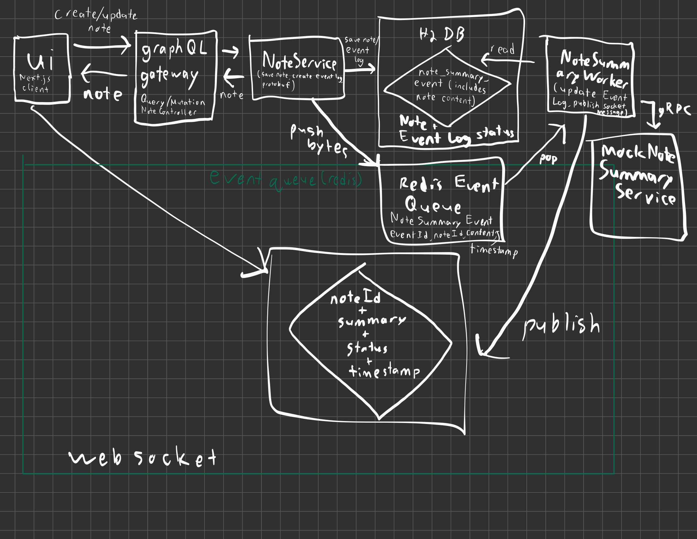
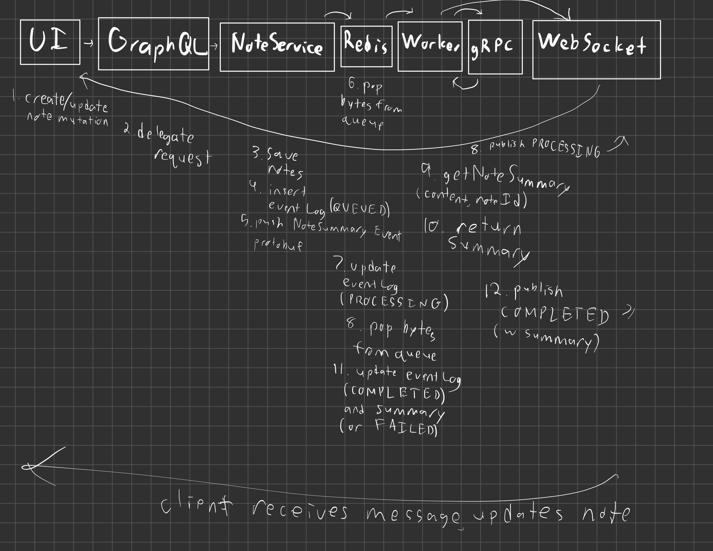

**Concurrent Notes Project RFC**

**MVP Technical Problem Statement**

This project extends the “Notes” prototype project into a more thorough, asynchronous pipeline that extends functionality for summary generation. A user should be able to create, edit, and delete notes through the Next.js UI, while note summaries are generated in the background. Moreover, when features like the summary displays, adding notes, editing notes, should all happen in real-time as the UI is running. The system should be able to track an event’s lifecycle using an EventLog, which includes tracking the states of QUEUED, PROCESSING, COMPLETED, and FAILED. There should also be concurrency to make sure that the system works as intended if the user edits a note twice fairly quickly. On the frontend, summaries should appear in real time through WebSocket updates, with the UI showing the intermediate PROCESSING state, the final COMPLETED state, and FAILED in the case of any errors.

**System Diagram**

**Tradeoffs**

It’s crucial to look at the gRPC vs. GraphQL vs. REST tradeoffs. gRPC is the better choice for internal communication between the worker and summary-service. A company would likely prefer gRPC for efficiency, stronger contracts, and an easier scaling of internal services. gRPC gives a stricter schema, generated server/client code, and lower payload overhead, making it better for internal communication. Protobuf stores and sends data more compactly than JSON and makes for a stronger schema enforcement. In this system, GraphQL is still the better choice because the browser needs flexible reads and mutations for notes, in regards to, for example, fetching note lists, fetching a selected note, and performing create/edit/delete operations while only requesting the fields it needs. REST would be fine for simple CRUD endpoints, but it’s not as needed here because the project already has GraphQL’s flexible client-facing schema and gRPC’s efficient internal RPC boundary.

**Race Condition**

The main race condition occurs when the same note is edited twice quickly. Lets say the first edit, edit A, creates Event A which has a timestamp of t1, and the second edit, edit B, creates Event B, with timestamp t2. Both events are pushed to Redis. If Event B finishes first, the worker sends a COMPLETED WebSocket message containing the newer summary and timestamp t2, and the frontend stores that summary for the note. After, Event A finishes and sends another COMPLETED message, but now with the older timestamp t1. Without a proper guard, the summary from Edit A would overwrite the correct summary of Edit B. The fix is the timestamp guard, which is that when a WebSocket message arrives, the frontend compares the timestamp of the message against the timestamp currently stored for that note and only applies the update if the incoming timestamp is greater (newer). This prevents stale summaries from appearing in the UI even if the edit order is different.

**Sequence Diagram**

